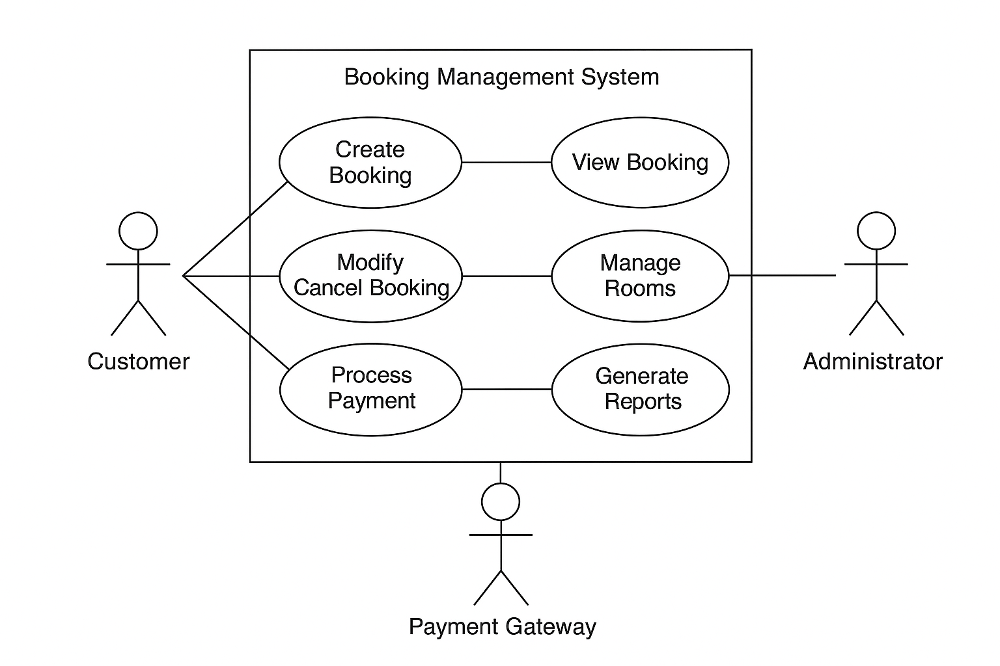

# Requirement Analysis in Software Development

## About
This repository is dedicated to exploring the process of requirement analysis in software development.  
It covers the techniques, tools, and documentation practices used to gather, analyze, and manage software requirements effectively.  

## What is Requirement Analysis?

**Requirement Analysis** is the process of identifying, gathering, and defining the needs and expectations of stakeholders for a software system. It is one of the most critical phases in the **Software Development Life Cycle (SDLC)** because it lays the foundation for all subsequent stages such as design, development, testing, and deployment.

During requirement analysis, software engineers and analysts work closely with clients, users, and other stakeholders to understand what the system should do, what problems it should solve, and what constraints it must operate within.

### Importance of Requirement Analysis
1. **Prevents Misunderstanding:** Ensures that all stakeholders share a common understanding of the project’s goals and requirements.  
2. **Saves Time and Cost:** Detecting unclear or incorrect requirements early helps avoid expensive rework later in the project.  
3. **Improves Quality:** Clear and well-documented requirements lead to better system design and more effective testing.  
4. **Guides the Development Process:** Requirements act as a blueprint for developers, testers, and project managers throughout the SDLC.  
5. **Enhances Client Satisfaction:** When the delivered software meets the user’s real needs, client satisfaction and trust increase.

In summary, requirement analysis is not just about collecting what users want, it’s about understanding why they need it and translating those needs into precise, actionable requirements that developers can implement successfully.

## Why is Requirement Analysis Important?

Requirement Analysis plays a vital role in the **Software Development Life Cycle (SDLC)** because it determines the success or failure of a project. Without proper requirement analysis, teams risk building software that does not meet user needs or business objectives.

Here are three key reasons why Requirement Analysis is critical:

### 1. Ensures Clear Understanding of Project Goals
Requirement analysis helps all stakeholders — clients, developers, and project managers — share a unified understanding of what needs to be built. This clarity minimizes confusion and reduces the chances of miscommunication or feature creep during development.

### 2. Saves Time and Resources
Identifying requirements early helps detect issues before development begins. Correcting mistakes at later stages (like coding or testing) is far more costly and time-consuming. Proper analysis ensures that the team works efficiently with fewer revisions and delays.

### 3. Improves Software Quality and User Satisfaction
When requirements are well-defined and aligned with user needs, the resulting software is more reliable, user-friendly, and effective. This leads to higher customer satisfaction and builds trust between the development team and the client.

In essence, **requirement analysis is the backbone of a successful software project**, ensuring that the right product is built the right way.

## Key Activities in Requirement Analysis

Requirement Analysis involves several key activities that ensure the software requirements are well understood, accurate, and complete.  
Each activity contributes to transforming user needs into clearly defined system requirements.

### 1. Requirement Gathering
- This is the initial step where information is collected from stakeholders such as clients, users, and subject matter experts.  
- The goal is to understand their expectations, business objectives, and system needs.  
- Techniques used include interviews, surveys, observations, and studying existing documentation.

### 2. Requirement Elicitation
- Involves extracting and clarifying requirements through interactive sessions with stakeholders.  
- Helps uncover hidden, conflicting, or unclear requirements that might not be directly stated.  
- Common techniques include brainstorming, workshops, focus groups, and use case analysis.

### 3. Requirement Documentation
- All gathered and elicited requirements are recorded in a structured format, usually in a **Software Requirements Specification (SRS)** document.  
- Documentation ensures that everyone has a reference point for what is expected in the project.  
- It also supports traceability and accountability throughout the SDLC.

### 4. Requirement Analysis and Modeling
- The collected requirements are analyzed to identify feasibility, consistency, completeness, and priority.  
- Models such as data flow diagrams (DFDs), entity-relationship diagrams (ERDs), and use case diagrams are created to visualize the system.  
- This step bridges the gap between business needs and technical design.

### 5. Requirement Validation
- Ensures that all documented requirements truly represent the client’s needs and align with business goals.  
- Involves reviewing, prototyping, and walkthroughs with stakeholders.  
- Validation helps detect and correct errors before development begins, saving time and costs later.

Together, these activities ensure that the development team builds a system that meets both **business objectives** and **user expectations** effectively.

## Types of Requirements

In software development, requirements are generally classified into two main categories: **Functional Requirements** and **Non-functional Requirements**.  
Both types are essential to ensure the system performs correctly and provides a positive user experience.

---

### 1. Functional Requirements

**Definition:**  
Functional requirements describe *what the system should do*.  
They define the specific behaviors, features, and functions the software must perform to meet user needs.

**Examples (Booking Management System):**
- The system shall allow users to create new bookings for available rooms.  
- The system shall send confirmation emails after a booking is completed.  
- The system shall allow users to cancel or modify their reservations.  
- The system shall enable administrators to view all bookings and generate daily reports.  
- The system shall allow users to make payments securely using credit cards or mobile money.  

These requirements directly determine the system’s functionality and guide developers during implementation.

---

### 2. Non-functional Requirements

**Definition:**  
Non-functional requirements specify *how the system performs its functions*.  
They describe the quality attributes, performance standards, and constraints of the system rather than specific behaviors.

**Examples (Booking Management System):**
- The system should load the booking page within **3 seconds** under normal network conditions.  
- The application should be available **99.9% of the time** to ensure reliability.  
- User data must be encrypted during transmission and storage for security.  
- The interface should be responsive and accessible on mobile, tablet, and desktop devices.  
- The system should support at least **10,000 concurrent users** without performance degradation.  

Non-functional requirements help define the **usability, reliability, performance, and security** of the system — ensuring that it not only works, but works *well*.

Together, functional and non-functional requirements provide a complete understanding of **what** the system should do and **how well** it should perform.

## Use Case Diagrams

A **Use Case Diagram** is a visual representation that shows how different users (called *actors*) interact with a system.  
It helps identify the system’s functionality from the user’s perspective and clarifies the relationships between users and the actions they can perform.

### Benefits of Use Case Diagrams
- **Simplifies understanding** — shows what the system does without going into technical details.  
- **Improves communication** between developers, clients, and stakeholders.  
- **Helps identify requirements** early in the project.  
- **Guides testing** by outlining the main user interactions that need verification.

---

### 🎯 Example: Booking Management System Use Case Diagram

Below is a sample Use Case Diagram for the **Booking Management System**.

**Actors:**
- **Customer** – books, views, or cancels a reservation.  
- **Administrator** – manages bookings, rooms, and generates reports.  
- **Payment Gateway** – handles secure payment processing.

**Use Cases:**
- Create Booking  
- View Booking  
- Modify/Cancel Booking  
- Process Payment  
- Manage Rooms  
- Generate Reports

The diagram shows how customers and administrators interact with the system, and how the payment gateway supports transaction processing.

## Acceptance Criteria

**Acceptance Criteria** are the predefined conditions or statements that a software feature must meet to be accepted by the client, user, or testing team.  
They describe the boundaries of a user story or feature and define what “done” means from a stakeholder’s perspective.

### Importance of Acceptance Criteria
- **Ensures clarity:** Clearly defines what needs to be built and tested, preventing misunderstandings between developers and clients.  
- **Supports validation and testing:** Provides measurable conditions to verify whether a feature meets requirements.  
- **Improves communication:** Acts as a shared reference point between stakeholders, developers, and QA testers.  
- **Reduces scope creep:** Helps the team stay focused on agreed-upon deliverables.  
- **Boosts quality assurance:** Ensures that features align with business goals and user expectations before release.

### 🧾 Example: Acceptance Criteria for the Checkout Feature

**Feature:** Checkout in the Booking Management System

**Acceptance Criteria:**
1. The user must be able to view a summary of their booking before proceeding to payment.  
2. The checkout page must display the total amount, including taxes and service fees.  
3. The user must be able to choose a payment method (credit card or mobile money).  
4. The system must validate payment details before submission.  
5. On successful payment, a confirmation email should be sent automatically to the user.  
6. If the payment fails, the user should receive an error message and be prompted to try again.  
7. The system must securely store payment transaction details for record-keeping.  

In summary, **acceptance criteria act as a checklist** for determining whether a feature functions correctly, meets user expectations, and is ready for deployment.
